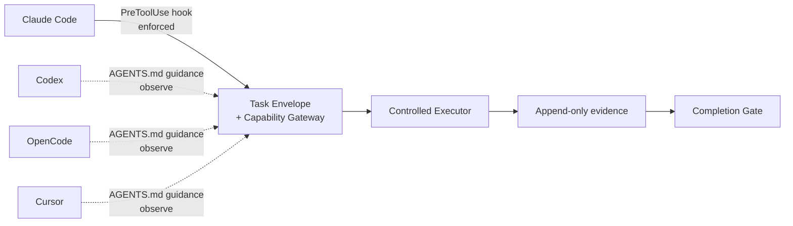

# Adaptive Harness

**Keep your coding client. Add verifiable governance.**

Adaptive Harness is a local-first governance runtime for software-development
agents. It works alongside the client you already use—Claude Code, Codex,
OpenCode, Cursor, or a plain terminal—instead of replacing it with another
agent workflow.

It adds four guarantees that client prompts alone cannot provide:

- **Stable task identity:** every task is bound to a real Git worktree and base
  SHA.
- **Typed capability boundaries:** permissions follow declared side effects,
  paths, networks, and execution limits—not task names or model intent.
- **Trusted evidence:** executor results and failures are recorded as evidence;
  model self-assessment is not accepted as proof.
- **A real completion gate:** `completed` is available only when current,
  authorized acceptance evidence satisfies the task.

Canonical policy stays in versioned `.harness/*.json` files, while client
instructions and hooks remain thin, replaceable projections.

## How it fits



At the client edge, the solid arrow represents verified interception. Dotted
arrows represent prompt-level guidance: the client can follow the Harness path,
but the instructions cannot prevent it from bypassing that path.

## Integrate with your existing client

[Install `adp-harness`](#install) first if it is not already available, then choose
the client you use in the repository. Run `adp-harness integration list` at any
time to inspect the supported adapters and their verified capability modes.

| Client | Integration level | Project entry point | Mode | Blocks mutating-tool bypasses? |
| --- | --- | --- | --- | --- |
| Claude Code | Official adapter | `CLAUDE.md` + `.claude/settings.json` | `enforced` when healthy | Yes, through `PreToolUse` and the controlled executor |
| Codex | Official adapter | Managed `AGENTS.md` block | `observe` | No—prompt-only |
| [OpenCode](https://dev.opencode.ai/docs/rules/) | Compatible instructions | Root `AGENTS.md` | `observe` | No—prompt-only |
| [Cursor](https://docs.cursor.com/context/rules-for-ai) | Compatible instructions | Root `AGENTS.md` | `observe` | No—prompt-only |

OpenCode and Cursor are compatibility paths through the Generic adapter, not
native adapters in the current MVP.

`AGENTS.md` and `CLAUDE.md` guide client behavior; they are not security
boundaries. Adaptive Harness uses the word `enforced` only for a verified
native interceptor, and its controlled executor fails closed when the required
host sandbox is unavailable.

### Claude Code: native `PreToolUse` enforcement

Run the first command to inspect every proposed file, then apply the same plan:

```bash
adp-harness init --adapter claude-code
adp-harness init --adapter claude-code --apply
adp-harness doctor --verbose
```

This preserves existing `CLAUDE.md` content, adds a versioned managed block,
creates the canonical `.harness/` files, and merges the following hook into
`.claude/settings.json`:

```json
{
  "hooks": {
    "PreToolUse": [
      {
        "hooks": [
          {
            "command": "\"$HOME/.local/bin/adp-harness\" adapter-hook claude-code || exit 2",
            "statusMessage": "Adaptive Harness policy check",
            "timeout": 5,
            "type": "command"
          }
        ],
        "matcher": "Bash|Edit|Write|NotebookEdit|MultiEdit|mcp__.*"
      }
    ]
  }
}
```

The hook permits read-only tools, rejects direct mutating tools, and accepts
only the exact `"$HOME/.local/bin/adp-harness" capability run --task …
--capability …` launcher. The absolute user-level path keeps the hook working
when Claude Code is launched from a GUI that does not inherit your terminal
`PATH`.
Copying the JSON alone is not a complete integration: it does not create the
canonical task policy or the managed `CLAUDE.md` projection.

Claude Code is `enforced` only while `adp-harness doctor` reports the adapter hook
and managed projection healthy. Capability execution additionally requires a
supported host sandbox and fails closed without one. Linux enforcement requires
Bubblewrap and working user namespaces; otherwise the base CLI and explicit
`observe` workflows remain available.

### Codex: managed `AGENTS.md`

```bash
adp-harness init --adapter codex
adp-harness init --adapter codex --apply
adp-harness doctor --verbose
```

Adaptive Harness preserves existing `AGENTS.md` content and adds a small,
versioned block instructing Codex to start tasks, request capabilities, and
verify through Harness. The integration is intentionally `observe`: Codex can
read and follow the instructions, but the file cannot intercept a bypassing
tool call.

### OpenCode and Cursor: portable `AGENTS.md` instructions

[OpenCode project rules](https://dev.opencode.ai/docs/rules/) and
[Cursor rules](https://docs.cursor.com/context/rules-for-ai) both support a
root-level `AGENTS.md`. Initialize the client-independent runtime first:

```bash
adp-harness init --adapter generic
adp-harness init --adapter generic --apply
adp-harness doctor --verbose
```

Then add this plain Markdown fragment to the repository's existing
`AGENTS.md`, or create the file if it does not exist:

```md
## Adaptive Harness

Use Adaptive Harness for repository-changing tasks.
Start or resume the task through `"$HOME/.local/bin/adp-harness" task`, request capability
escalation through Harness, and run Harness verification before completion.
Treat Harness task status and executor evidence as authoritative.
```

This fragment is immediately readable by both clients, but remains a
prompt-only `observe` integration. Because it is copied manually rather than
generated as a managed projection, `adp-harness doctor` does not drift-check the
fragment.

### Switch an initialized project between official adapters

Canonical task policy and evidence do not belong to the client projection.
Review and apply a projection change without reinitializing the project:

```bash
adp-harness integration install claude-code
adp-harness integration install claude-code --apply
adp-harness doctor --verbose
```

Use `codex` in place of `claude-code` to switch to the Codex projection. The
transaction preserves unrelated user content and replaces only
Harness-managed instructions and native hook settings.

## Try it in 5 minutes

[](https://codespaces.new/hilt21/Adaptive-Harness?quickstart=1)

After the Codespace is ready, the
[Python quickstart](examples/python-quickstart/README.md) takes about five
minutes to preserve a failing test as evidence, record a successful fix, and
pass the completion gate. One additional minute enables progressive TDD
guidance and shows it activate only for the next matching task. The same Dev
Container works locally in VS Code.

## Contributing

Contributions are welcome:

- Read the [contributing guide](CONTRIBUTING.md) before opening a pull request.
- Pick a scoped task from the
  [good first issues](https://github.com/hilt21/Adaptive-Harness/issues?q=is%3Aissue+is%3Aopen+label%3A%22good+first+issue%22).
- Follow current priorities in the
  [public roadmap](https://github.com/hilt21/Adaptive-Harness/issues/4).

For substantial behavior or architecture changes, open an issue before
implementation. The [product requirements](docs/adaptive-harness-prd.md)
remain the source of truth for MVP scope and safety invariants.

## Install

Install the published, self-contained CLI for the current user. This does not require Python, a Python package manager, or `sudo`, and it does not modify the current repository:

```bash
curl --proto '=https' --tlsv1.2 -LsSf \
  https://github.com/hilt21/Adaptive-Harness/releases/latest/download/install.sh | sh
adp-harness --version
```

To install a fixed release instead of `latest`, set its SemVer explicitly:

```bash
curl --proto '=https' --tlsv1.2 -LsSf \
  https://github.com/hilt21/Adaptive-Harness/releases/latest/download/install.sh \
  | HARNESS_VERSION=0.2.0 sh
```

The installer selects the platform artifact, verifies its checksum, and installs
`adp-harness` in `~/.local/bin`. If that directory is not available in a clean
new shell, it shows one small managed change to the default zsh, bash, or fish
configuration and asks once before writing it atomically. Declining stops the
installation without leaving a partial Runtime. Open a new terminal after the
installer finishes; no temporary `export PATH=...` is required.

Non-interactive installation proceeds only when the clean-shell check already
passes or the caller explicitly sets `HARNESS_CONFIRM_PATH=1`. An unknown
default shell, an unrelated `adp-harness` elsewhere on `PATH`, or an
unverifiable file at the target path stops the installer without overwriting
anything.

If an install, update, rollback, or uninstall process is interrupted, a
fail-closed lock may remain. The next command prints the exact lock-file path;
first confirm that no Adaptive Harness lifecycle command is still running,
then remove only that lock file and retry.

To inspect and verify the installer before executing it, download both release files and compare the published SHA-256 entry:

```bash
curl --proto '=https' --tlsv1.2 -LsSf \
  -o install.sh \
  https://github.com/hilt21/Adaptive-Harness/releases/latest/download/install.sh
curl --proto '=https' --tlsv1.2 -LsSf \
  -o SHA256SUMS \
  https://github.com/hilt21/Adaptive-Harness/releases/latest/download/SHA256SUMS
expected=$(awk '$2 == "install.sh" { print $1 }' SHA256SUMS)
actual=$(shasum -a 256 install.sh | awk '{ print $1 }')
test -n "$expected" && test "$actual" = "$expected"
less install.sh
HARNESS_VERSION=0.2.0 sh install.sh
```

Python packaging remains an advanced alternative for users who already manage
isolated CLI tools:

```bash
pipx install adaptive-harness
# or
uv tool install adaptive-harness
```

The MVP supports macOS arm64 and glibc Linux on arm64 and x86_64. WSL2 follows
the Linux path experimentally; native Windows is not supported in `0.2.0`.
macOS x86_64 standalone publication requires a self-hosted Intel runner and is
not included in the current GitHub-hosted release matrix. The
[product requirements](docs/adaptive-harness-prd.md) remain the scope and
architecture source of truth.

Linux `enforced` execution also requires Bubblewrap and working user namespaces. The installer reports a missing sandbox dependency but never invokes `sudo` or a system package manager. Base CLI and explicit `observe` operation remain available.

For this source tree, use the development environment:

```bash
uv sync --dev
uv run adp-harness --version
```

Self-contained installations update only on explicit request:

```bash
adp-harness self update
adp-harness self rollback           # returns to the one verified previous Runtime
adp-harness self uninstall          # preserves local records and repository config
adp-harness self uninstall --purge-data
```

Running the installer again does not perform a normal upgrade; it points a
healthy installation to `adp-harness self update`. If the v2 installation
manifest proves that a damaged launcher or Runtime belongs to Adaptive Harness,
the same installer shows a repair plan and asks before replacing it. If
ownership cannot be established, it stops for manual inspection.

Package-manager installations must be updated and removed with the package
manager that installed them; `self update`, `self rollback`, and standalone
repair do not manage those installations.

## Initialize without a client projection

Use the Generic adapter for a terminal-only workflow, CI, or a client whose
instruction file you manage manually. The project must be a Git repository
with an initial commit. Deterministic scanning needs a declared test command;
for example, a Python project can declare pytest in `pyproject.toml`, while a
Node project can declare a test script in `package.json`.

Initialization is review-first. The first command prints a complete diff and writes nothing:

```bash
adp-harness init --adapter generic
adp-harness init --adapter generic --apply
adp-harness doctor --verbose
```

The Generic adapter creates no client instruction file and is explicitly
`observe`. To add an official projection later, use `adp-harness integration
install` as shown above. Commit the three canonical files and any client
projection you selected before starting the first task:

```text
.harness/config.json
.harness/capabilities.json
.harness/modules.lock.json
```

## Run the first governed task

Give the task an explicit ID, scope, capability, and optional module traits:

```bash
adp-harness task start \
  --id first-task \
  --goal "Fix the failing example" \
  --scope src \
  --scope tests \
  --capability project-tests \
  --trait code-change

adp-harness capability run \
  --task first-task \
  --capability project-tests

adp-harness task verify first-task
```

`completed` is produced only when required acceptance evidence, workspace identity, scope, and security invariants all pass. `task accept-risk` can waive only explicitly waivable verification gaps.

Capabilities with `approval_policy: "ask"` or high-risk side effects require a separately reviewed, task/SHA/worktree/path/count/expiry-bound approval:

```bash
adp-harness capability approve \
  --task first-task \
  --capability project-tests
adp-harness capability approve \
  --task first-task \
  --capability project-tests \
  --apply
```

The plan command changes no task history. An applied approval is append-only and cannot be reused outside its exact scope or use count.

## Local records and storage

Runtime records are isolated by repository identity under the user data directory. The default is `~/.local/share/harness/projects/<repository-id>/`, or `$XDG_DATA_HOME/harness/projects/<repository-id>/` when XDG is configured. Project statistics are shared by linked worktrees, while task records and artifacts live under a worktree-specific `worktrees/<worktree-id>/` directory. Different repositories and worktrees do not share task evidence.

An advanced, per-clone mode keeps records in the Git common directory, normally `.git/adaptive-harness/`. It does not write runtime data beside the committed `.harness/*.json` files and is not offered during first-time initialization:

```bash
adp-harness storage mode
adp-harness storage migrate repository-local
adp-harness storage migrate repository-local --apply
adp-harness storage migrate user-data --rollback
adp-harness storage migrate user-data --rollback --apply --yes
```

Migration is review-first. It is rejected while a task is active or when the target already contains records; apply copies and verifies data, atomically changes the local mode, and retains the source as a rollback copy. An immediate `--rollback` may switch to that retained copy only while it still exactly matches the active records. A later reverse migration follows the normal process after the retained target has been explicitly archived or pruned; existing records are never merged automatically.

## Progressive modules and templates

Modules are installed but unloaded by default. Enablement is review-first; task JSON and human output report `installed`, `enabled`, `suggested`, `activated`, or `blocked`. Context appears only for `activated` modules.

```bash
adp-harness module enable tdd-guidance --policy auto
adp-harness module enable tdd-guidance --policy auto --apply
adp-harness task start \
  --id tdd-task \
  --goal "Add validation" \
  --scope src \
  --capability project-tests \
  --trait code-change
```

Trials require explicit measured results before promotion:

```bash
adp-harness module trial tdd-guidance --tasks 3 --apply
adp-harness module trial-result tdd-guidance beneficial \
  --task task-1 \
  --evidence-ref record:task-1 \
  --apply
adp-harness module promote tdd-guidance --apply
```

Templates are inert and only write after an explicit render, diff review, and confirmation:

```bash
adp-harness template render handoff --output docs/handoff.md
adp-harness template render handoff --output docs/handoff.md --apply
```

## Development and verification

```bash
uv sync --dev
uv run ruff check .
uv run mypy src tests
uv run pytest
uv build
```

Real host sandbox tests are opt-in locally because nested test-runner sandboxes may block them:

```bash
HARNESS_RUN_OS_SANDBOX_E2E=1 uv run pytest -q \
  tests/modules/test_runner.py \
  tests/core/test_verifier.py \
  tests/cli/test_cli.py \
  -k 'runner or enforced' --no-cov
```

All commands provide stable exit codes and JSON output through their local `--json` option. Mutations show the proposed change before confirmation; non-interactive JSON apply requires `--yes`.

Human summaries and top-level help support English and Simplified Chinese. The locale option precedes the command; JSON fields and protocol values remain stable English:

```bash
adp-harness --locale zh-CN doctor
adp-harness --locale zh-CN doctor --json
```
